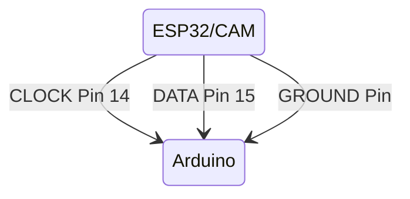
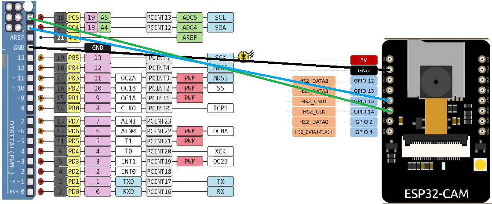

#### Since ESP32-CAM doesn't have exposed SDA and SCL pins due to camera and SD card support this makes exposed pin 14 and 15, I2C enable.



```mermaid
    ESP32 (Master)     Arduino (Slave)
    SDA (PIN 15) ----- SDA (A4/SDA)
    SCL (PIN 14) ----- SCL (A5/SCL)
    GND -------------- GND
```
### Demo



### More about I2C

1. [ESP32 I2C Master and Slave (I2C Communication Between Two ESP32) – Arduino IDE](https://randomnerdtutorials.com/esp32-i2c-master-slave-arduino/)

2. [How I2C Communication Works and How To Use It with Arduino](https://youtu.be/6IAkYpmA1DQ?si=0E7bup_vQd3k5jyP)

3. [I2C Addresses](https://youtube.com/shorts/8R13KHx4dTQ?si=ghERTNMTDifXh4Wl)

4. [Ai-thinker esp32-cam. How do i connect I2C MPU6050?](https://www.reddit.com/r/esp32/comments/ccqk02/aithinker_esp32cam_how_do_i_connect_i2c_mpu6050/)